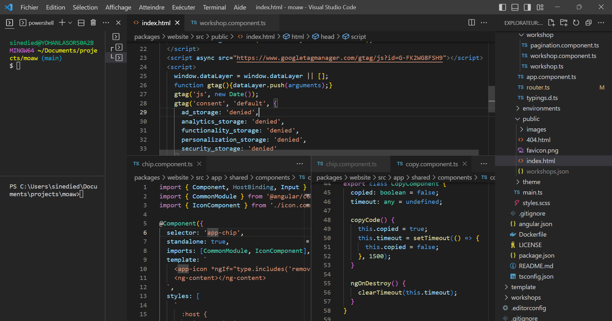

Lately, I've been writing more code both at work and on my own projects. It got me thinking—maybe I should understand the design engineer role better.

A design engineer bridges design and engineering. They can design user interfaces and have the technical skills to code them. They often make prototypes in code, contribute to design systems, and take projects from concept to production, which is why I'm interested in them.

## Why Do Most Design Engineers Come from an Engineering Background?

One thing that struck me when reading about the role is that most design engineers come from a developer background, particularly frontend or web development. Many of the people in [Maggie Appleton's "collection of Design Engineers"](https://maggieappleton.com/design-engineers) seem to come from an engineering background. Design engineers often start by writing software and then transition into design. It's pretty rare to see someone move into it from a pure design background.

As someone who comes from a design background, I think it is harder to move from design into a design engineering role than vice versa. I will lay out my position here and explain the hurdles you might face as a designer.

## Learning to Code Isn't the Biggest Hurdle

Surprisingly, the actual programming part—writing HTML, CSS, maybe some JavaScript—isn't the hardest hurdle. There are tons of tutorials out there, and modern design tools are getting closer to how you'd style components in code. On YouTube, you can find loads of tutorials, and if you prefer to read, there are some great blogs and reference sites like [MDN](https://developer.mozilla.org/en-US/).

The first real challenge is figuring out the tools. If you're a UX designer today, you're probably spending most of your time in Figma. As you move more towards engineering, you'll need to get used to new tools.

Setting up an IDE like VS Code with some plug-ins doesn't take long but is very different from Figma. Then there's the whole environment setup and getting your head around version control systems like Git, where you'll have to type cryptic commands into a terminal just to get things running. For someone who's never touched the command line, that can be pretty intimidating. Especially for designers who haven't worked with version handling beyond naming files "final_design_v3_final.psd."

## How Things Work in the Real World

Next up is learning how things are done "in the real world." Even if you've studied hard and done a lot of personal projects, when you get to an enterprise environment, things are often done differently.

> Say you're a new web developer on the job, and you're given a ticket to have a button open an informational popup for users to read for extra information. You have a solid grasp of the fundamentals, so you make a Pull Request where you implement this [as a popover](https://frontendmasters.com/blog/popover-api-is-here/) (e.g. `
Extra information.
`).
>
> Then the feedback arrives: … but that's not how it's done _here_…
>
> At this job, with this current code base, you:
>
> 1. Use the existing `<Popup />` element from the Design System.
> 2. Keep the content in the `Copy` package as HTML strings, so it can be translated.
> 3. Make an enum for it (e.g. `export const POPOVER_EXTRA_INFORMATION = "POPOVER_EXTRA_INFORMATION"`) so that anywhere that refers to this component or copy has a consistent name.
> 4. Has a component test ensuring it functions correctly.
> 5. Use special classes from the design system in order to create variations, rather than it's own bespoke styles.
>
> None of those things are really "fundamentals", they are _conventions_ that this particular code base has grown into over time to make it manageable
>
> — [What Skills Should You Focus on as Junior Web Developer in 2024?](https://frontendmasters.com/blog/what-skills-should-you-focus-on-as-junior-web-developer-in-2024/)

These conventions won't be in coding courses. Writing tests, code reviews, and engineering processes are areas where designers might struggle.

This is an area where there's surprisingly little information out there. I'm guessing it's the kind of trade knowledge that people just learn and don't feel the need to describe. The best resource I've found are videos from [webdevcody](https://www.youtube.com/@WebDevCody).

    <iframe src="https://www.youtube.com/embed/Dl-BdxNRUqs?si=vRQSQImf1iNL5rs8" title="YouTube video player" frameborder="0" allow="accelerometer; autoplay; clipboard-write; encrypted-media; gyroscope; picture-in-picture; web-share" referrerpolicy="strict-origin-when-cross-origin" allowfullscreen></iframe>

## The Biggest Hurdles Are Organizational

Honestly, the biggest challenges are organizational. You'll probably need to convince IT to give you admin access to install new programs. Getting access to repositories on GitHub or wherever means talking to the DevOps team or an engineering manager.

You'll also need support from your manager to grow into this kind of role. They might not fully understand what you're trying to do, but their backing is crucial. You'll also need guidance from someone in engineering, which might slow things down as you learn on the job. Remember, you're essentially taking on a junior or intern dev role in addition to your designer role.

If you're part of the design team but doing engineering work, you might end up out of sync with both sides. You could find yourself attending more meetings, trying to stay updated with both departments.

When performance review time comes around, things can get even trickier. How will your manager assess your performance? If you don't fit neatly into the usual job descriptions or leveling guides, it might be hard for them to justify a raise or promotion, even if you've made significant contributions. My only advice is to keep track of what you're doing and show how things would have been missed if you weren't there to catch them.

## Is it easier for Engineers to move toward Design?

On the flip side, if an engineer wants to move toward design, it might be a bit easier. They can expand design specifications while still closing tickets. They don't need access to new tools and will still fit into the usual engineering org. They might take longer to finish tasks because they're spending more time on design, but that's a similar challenge designers face when they start coding.

One thing I've noticed is that learning resources for design aren't as comprehensive as those for coding. They often focus on how to use tools rather than teaching design principles. It's tough to find resources that delve into topics like advanced typography beyond the basics.

## What to think about for Designers

If you're a designer wanting to become a design engineer, your best bet might be working freelance or at a smaller company. Startups are probably ideal since you'd need to help out with a variety of tasks anyway.

A design engineering role, like any hybrid role, works best if you already have trouble fitting into a mold. If you've been working for a while as a designer, it can feel like starting over. You'll need to augment the skills you already have to stand out.

Focus on areas where you can outperform a full-stack engineer. It could be animation, clever ways to handle design tokens, typography, or micro-adjustments to layout. Use your design eye to add final touches that make a difference.

## Transitioning to Design Engineering is hard but possible

Making the transition from design to design engineering is challenging but definitely possible. It helps to be in an environment that supports your growth and understands the value you bring. Having managers and colleagues who back you up can make a huge difference.

So, if you're thinking about making this move, be prepared for some obstacles, but know that it's achievable. And if you're already on this path, I'd love to hear about your experiences.
