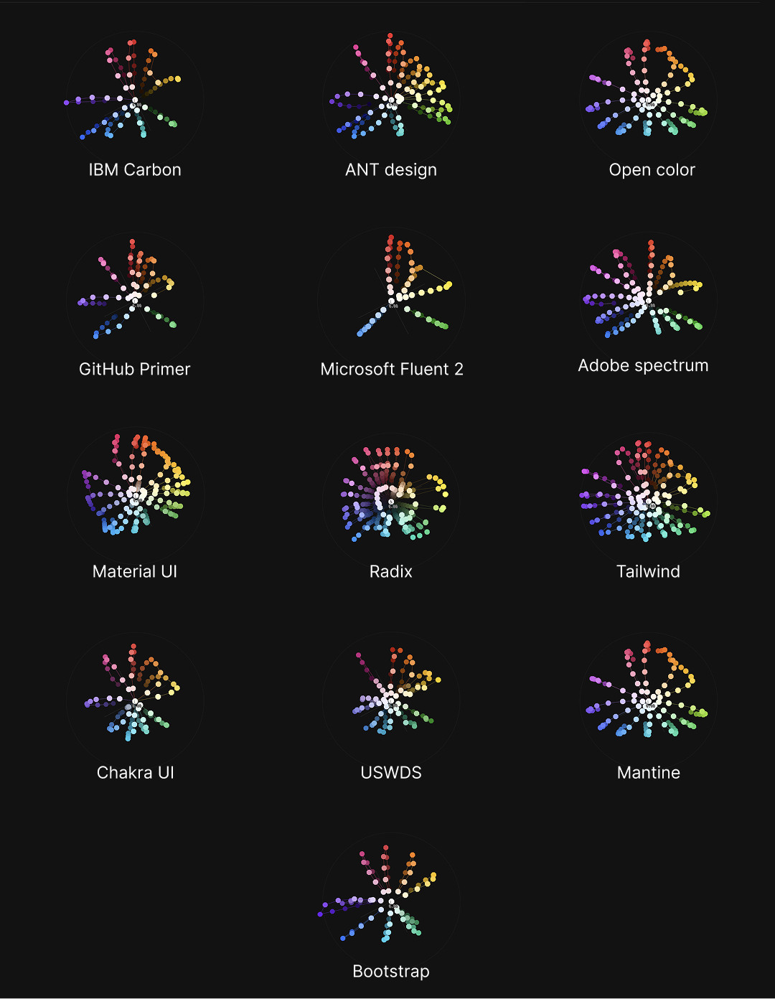
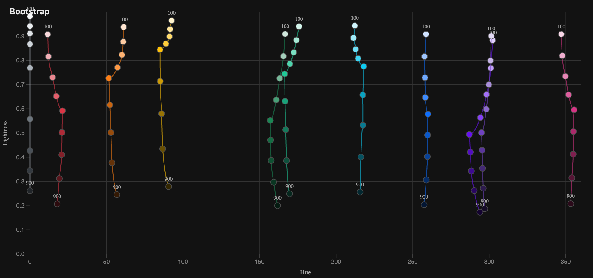
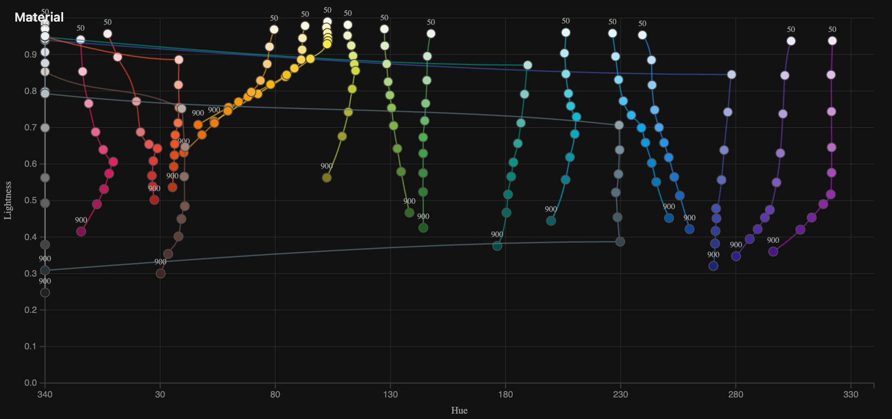
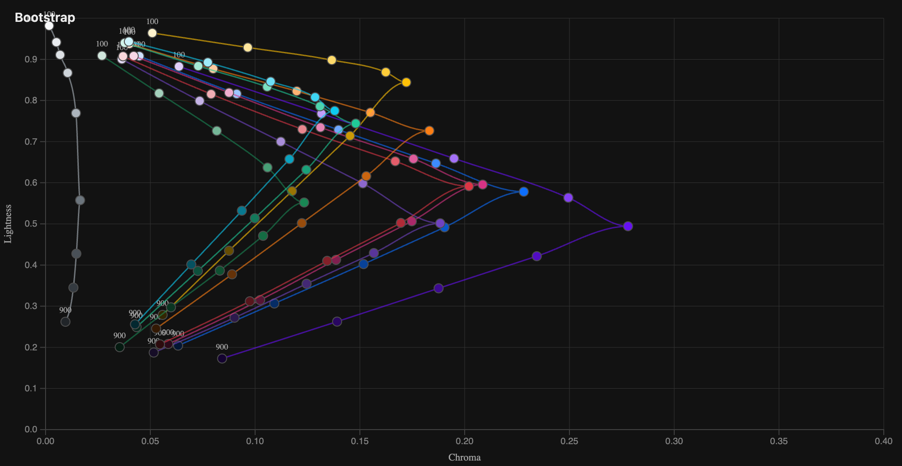
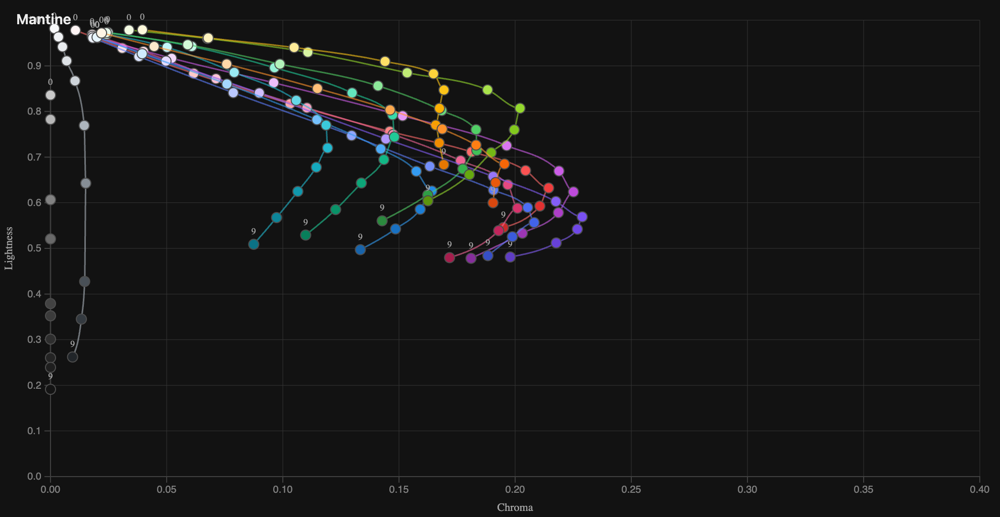
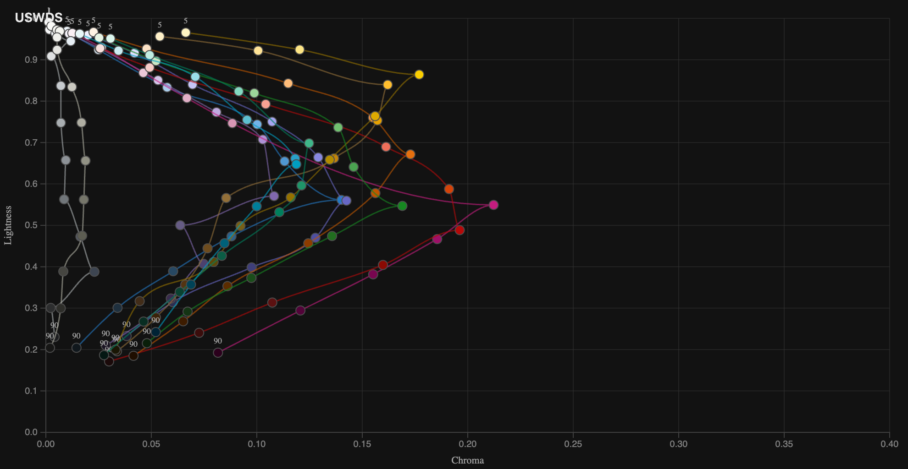
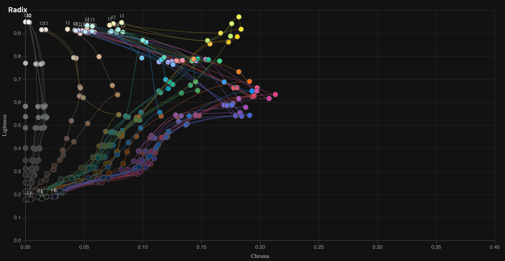

We're redoing our design system again.

I've done this a couple of times by now, but this time I wanted to get a better overview of how our approach compares with what other companies are doing — or, more specifically, what other open-source design systems are doing.

One of the things I've been looking at is color.

Most design token systems have some version of a **primitive layer** and a **semantic layer**.

The primitive layer is usually made up of color ramps: red 100–900, blue 100–900, grey 100–900, and so on.

The semantic layer then gives those colors meaning. `error`, for example, might reference `red-600`, while `surface-subtle` might reference `grey-100`.

This separation is useful for a couple of reasons. It makes it easier to build a harmonious color system, since a relatively small set of primitives gets reused throughout the product. It also makes things like themes much easier to manage.

Your semantic tokens can stay the same while their primitive references change underneath them.

So in light mode:

`background-primary → grey-50`

And in dark mode:

`background-primary → grey-950`

The component doesn't need to know anything changed.

That leaves an interesting question:

**What should the primitive colors actually look like?**

## Comparing primitive color systems

I wanted to see how some well-known open-source design systems approached this, so I vibecoded a little visualizer that plots their color tokens in OKLCH space.

<figure class="post-media post-media--hero">
  
  <figcaption>all the primitive colors from the 13 design systems i checked. Viewed from above the distance from the center becomes the chroma and the position on the circle is the hue</figcaption>
</figure>

The first version was basically a one-shot. I gave the agent the idea and the data sources and it produced most of the visualization in one go. I spent some more time afterwards tweaking the interaction and adding functionality, but I was still pretty impressed by how far it got from the initial prompt.

For the visualizations, I converted all of the colors into **OKLCH**.

I chose OKLCH because it gives me a much more useful common frame of reference than looking at hex or RGB values. Here, what I'm interested in isn't really the individual values themselves. I want to see the **relationship between the colors**: how their lightness, chroma and hue change as you move along a ramp.

And once you plot them like this, some fairly different approaches start to appear.

### Some color ramps are surprisingly sharp

<figure class="post-media">
  <video autoplay loop muted playsinline>
    <source src="antdesign-primitives-orbit.webm" type="video/webm">
  </video>
  <figcaption>Ant Design</figcaption>
</figure>

<figure class="post-media">
  <video autoplay loop muted playsinline>
    <source src="bootstrap-primitives-orbit.webm" type="video/webm">
  </video>
  <figcaption>Bootstrap</figcaption>
</figure>

Look at how sharp the ramps are in Bootstrap and Ant Design.

Chroma is represented by the distance from the center axis, and in both systems the ramps push outward very quickly around the middle. Their most saturated colors form a pretty pronounced point.

Compare that with Tailwind and Adobe Spectrum:

<figure class="post-media">
  <video autoplay loop muted playsinline>
    <source src="tailwind-primitives-orbit.webm" type="video/webm">
  </video>
  <figcaption>Tailwind</figcaption>
</figure>

<figure class="post-media">
  <video autoplay loop muted playsinline>
    <source src="spectrum-primitives-orbit.webm" type="video/webm">
  </video>
  <figcaption>Adobe Spectrum</figcaption>
</figure>

Tailwind has more colors and more steps in each ramp, but the shape is also noticeably gentler. Chroma increases and decreases more gradually.

Spectrum shows something similar.

I'm not sure there is necessarily a _correct_ shape here, but these systems are clearly making different choices about how quickly saturation should increase as you move toward the middle of the scale.

And I find it interesting that you can see those choices immediately when the colors are plotted spatially.

## Yellow refuses to behave

Another thing that becomes obvious in these visualizations is that the ramps aren't symmetrical.

The yellow side tends to sit higher in lightness than the opposite side of the hue spectrum.

That makes sense once you think about how color works perceptually.

You can make a blue very dark and it will still read as blue. If you make a yellow equally dark, it very quickly starts looking brown.

So maintaining the _perception_ of yellow across a scale often requires manipulating more than just lightness. You also start shifting hue and chroma.

This is where comparing hue against lightness becomes interesting.

<figure class="post-media">
  
  <figcaption>Bootstrap — hue vs lightness. The yellows and oranges go pretty much straight down</figcaption>
</figure>

<figure class="post-media">
  
  <figcaption>Material UI — hue vs lightness. Some of the yellows and oranges veer off to the left as they get darker</figcaption>
</figure>

Bootstrap's ramps are relatively straight when it comes to hue. As the colors become lighter or darker, the hue stays fairly stable.

Material UI is doing something much more aggressive. Look particularly at yellow and the two orange ramps. The hue changes quite dramatically as the colors move through different levels of lightness.

Those long lines extending toward the left are mostly the ends of the ramps approaching neutral colors. Once chroma gets very low, hue becomes less meaningful, so those points end up moving toward the edge of the visualization in the OKLCH space.

Still, the overall pattern is clear: some systems treat a color ramp mostly as a change in lightness and chroma, while others are quite happy to shift hue along the way. Especially for yellows.

## The side profile is also strangely satisfying

I also started looking at the ramps from the side, plotting lightness against chroma.

<figure class="post-media">
  
  <figcaption>Bootstrap — lightness vs chroma. arrows going straight out</figcaption>
</figure>

<figure class="post-media">
  
  <figcaption>Mantine — lightness vs chroma. like a wave cresting at the top. Mantine doesnt have darker primitive colors.</figcaption>
</figure>

<figure class="post-media">
  
  <figcaption>USWDS — lightness vs chroma. lighter hues (like yellows) have a higher midpoint compared to darker hues (like purples)</figcaption>
</figure>

<figure class="post-media">
  
  <figcaption>Radix — lightness vs chroma. Also clear light/dark midpoint difference and a nice lower chroma "shelf". Very consistent lightness values.</figcaption>
</figure>

I'm not entirely sure how much I'm learning from this view yet.

But it is nice to look at.

And there are some interesting differences.

You can see how quickly different systems introduce chroma, where saturation peaks, whether the peak sits around the middle of the ramp or is shifted toward lighter or darker colors, and how quickly the colors collapse back toward neutral at either end.

Radix, Mantine, Bootstrap and USWDS all end up producing noticeably different silhouettes.

That is probably the thing I find most interesting about this little exercise.

When you use these systems in a UI, their palettes can feel broadly similar: some blues, some reds, some neutrals, a bunch of steps in between.

But once you remove the interface and plot the underlying color decisions, you can see that the systems are actually making quite different choices about what a color ramp _is_.

I'm still exploring what, if anything, we should take from these patterns for our own design system.

But at the very least, plotting the colors makes something that is normally hidden inside token files much easier to reason about.

And it produces some very pretty shapes along the way.
