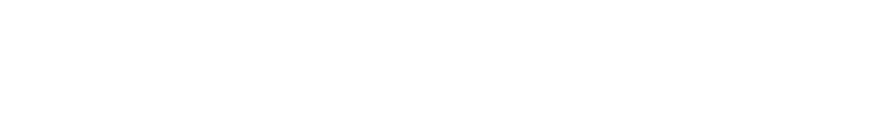
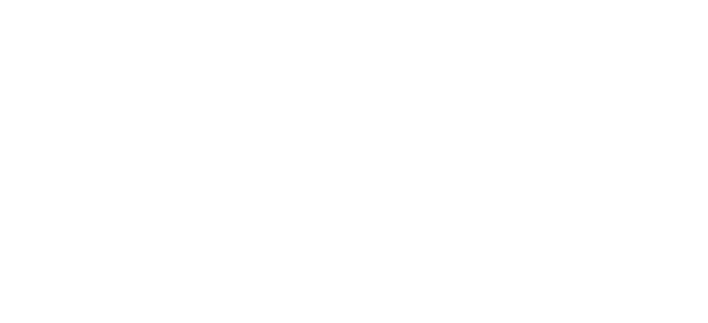

When I first learnt about ux design it was a role that did everything. Your job was to do research, make wireframes, hold workshops, make pixel perfect designs. It was a role where you needed to be able to talk with business people in business way, engineers in an engineering way, and with other designers. To me it seemed like daunting amount of skills you had to master.

When I actually started working i saw that the research role and the designer role was often split. It makes sense to me. Both of these roles takes a long time to become good at and they also the tasks for each role require a lot of time.

As time went on I saw more and more roles become popular. You had UX writers and then soon after that you had content designers. Graphical designers first became UI designers, then UX /UI designers and then maybe they started doing motion design when the big platforms started pushing video. And of course the design system designer.

As tech grew bigger and bigger there were more roles to fill. At big tech there were opportunities to niche yourself so you were both employable and able to focus on the of work that you enjoyed the most.

Today people are getting laid off left and right and the niches are disappearing. When your company suddenly need to "down-size" specialized roles are often the first to go.

I want to understand what niches might stick around but first we need to take a look backwards.

## Were there as many niched roles before the dotcom crash?

It seems to me that thee were a couple of strands that ended up being lumped into the UX designer role.

The first strand come from the marketing agencies. In the 90s the internet exploded and the people who had previously done print design, graphic designers, suddenly got a new medium to work in. Over time we have seen a constant exchange, both ways, between marketing agencies and big tech. Graphic designers have today become (in many instances) brand designers. We have also added motion designers to this mix.

Another strand we see from 80s marketing agencies are copy writers. Copy writers have branched out into UX writing and then content designers.

The second big influence comes from engineering. If you were a programmer with a knack for figuring out edge cases on the front end you might start to call yourself Interaction designer. We also get a big influx from the ergonomics. Early usability material uses a lot of similar methods as ergonomics.

The third one is researchers. Often from behavioral science. Interviews and and observations are staple methods in research. It's not surprising that academics wanted to see what it was like outside of the university and design was a good place to go. We are mostly talking about qualitative researches, maybe a few who are good at surveys. When i was going through textbooks about research for design it was mostly qualitative methods. Sometimes more quantitative methods were used but since the number of participants generally low and descriptive statistics was enough. I've never read anything about how qualitative research was/is used in marketing agencies but if you have any suggestions please let me know.

The last strand I've seen is from the "consultant" industry. By that I mean IDEO and the ideas they promoted. A while ago it struck me that IDEO never talks to designers, they are always talking to mangers and directors without a design background. I can't identify a particular role that comes from this influence but they have given us a lot of ideas and ideological baggage. I'm thinking of the workshop methods and of course the design thinking courses. There are more agancies than IDEO of course but I feel they exemplify this kind of influence.

I think I need to stop here for the sake of time and come back to the more current roles in design. As I said in the beginning I don't have any sources for this and I'm more trying to describe a vibe than actual facts.

If you were around for the dotcom crash i would love to hear how things looked before and after and if you have seen the same influences that i have.
